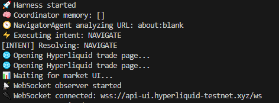

# 🚀 AI Autonomous Web Testing Harness — Hyperliquid (Autonomous QA Harness)

An advanced autonomous QA testing harness built with Playwright + Node.js that demonstrates how modern automation evolves from rigid scripts into intelligent, decision-driven systems.

This project validates **real-time trading UI health** on Hyperliquid using:

✔ Planner-based autonomous decision making  
✔ Intent-driven execution engine  
✔ WebSocket observability  
✔ Autonomous execution loops  
✔ UI health verification  

Inspired by modern harness engineering and intelligent testing patterns used in fintech automation.

--------------------------------------------------
🧠 PROJECT VISION
--------------------------------------------------

Traditional automation depends on:

- Static locators
- Sequential steps
- Fragile selectors

This harness introduces:

Planner-based reasoning  
+  
Intent-driven execution  
+  
Autonomous loop  
+  
Observability-first testing  

Instead of writing rigid scripts, the system observes UI context and decides what to do next dynamically.

--------------------------------------------------
🏗️ ARCHITECTURE OVERVIEW
--------------------------------------------------

Agent Layer:

- PlannerAgent V4 — environment analysis & decision logic

Harness Layer:

- TestHarness — autonomous execution loop
- IntentResolver — execution engine
- Health Summary System — UI health validation

Observability Layer:

- WebSocket Observer — realtime market feed monitoring
- Runtime Logging — intent tracking & diagnostics

Execution Layer:

- Playwright
- Chromium / Firefox / WebKit

This reflects a **practical autonomous QA harness**, not a research AI system.

--------------------------------------------------
⚙️ TECH STACK
--------------------------------------------------

- Playwright
- Node.js
- JavaScript
- Autonomous Agent Pattern
- Intent-Driven Automation
- WebSocket Monitoring
- Live Trading UI Validation

--------------------------------------------------
✨ CORE FEATURES
--------------------------------------------------

🤖 Planner Agent V4

Instead of static scripts:

Planner observes:

- URL state
- Trading UI visibility
- WebSocket readiness

Then decides next intent:

OPEN_TRADE_PANEL → PLACE_ORDER → DONE

🔁 Autonomous Harness Engine

Agent decides intent  
↓  
IntentResolver executes action  
↓  
Page state updates  
↓  
Agent decides next action  

No rigid step scripts required.

📡 WebSocket Observability

Harness monitors live market streams:

- detects WebSocket connections
- logs live frames
- validates realtime UI updates

Simulates production-level observability.

🟢 UI Health Summary

At the end of each run the harness prints:

Provides a clear automation signal for CI pipelines or scheduled monitoring.

--------------------------------------------------
📂 PROJECT STRUCTURE
--------------------------------------------------

hyperliquid-ai-test-harness/

agents/
  agent.js               (Planner Agent V4)

harness/
  runner.js              (Autonomous harness loop)

pages/
  tradePage.js

utils/
  intentResolver.js      (Execution engine)

tests/
  example.spec.js

playwright.config.js
README.md

--------------------------------------------------
▶️ HOW TO RUN
--------------------------------------------------

Install dependencies:

npm install

Install browsers:

npx playwright install

Run tests:

npx playwright test

Run specific browser:

npx playwright test --project=chromium
npx playwright test --project=firefox
npx playwright test --project=webkit

--------------------------------------------------
🔍 AUTONOMOUS FLOW SAMPLE
--------------------------------------------------

🚀 Harness started  
🧠 Planner V4 observing environment  
⚡ Executing intent: OPEN_TRADE_PANEL  
📡 WebSocket connected  
📥 WS Frame received  
⚡ Executing intent: PLACE_ORDER  
🟢 Hyperliquid UI HEALTHY  

--------------------------------------------------
⚠️ KNOWN LIMITATIONS
--------------------------------------------------

Firefox may intermittently fail during certain UI interactions due to:

- dynamic rendering differences in Hyperliquid UI
- animation timing differences across browsers
- canvas overlay behaviour

Chromium and WebKit runs are stable.

This reflects real-world automation challenges on live trading platforms.

--------------------------------------------------
💡 WHY THIS PROJECT STANDS OUT
--------------------------------------------------

This repository demonstrates:

- Harness engineering design
- Autonomous decision-driven testing
- Playwright architecture patterns
- WebSocket-aware UI validation
- Realistic fintech automation strategies

Represents the shift from traditional QA into intelligent autonomous harness systems.

--------------------------------------------------
🧭 FUTURE ROADMAP
--------------------------------------------------

- Scheduled GitHub Actions monitoring
- Expanded intent coverage
- Multi-flow autonomous scenarios
- Additional UI health metrics

--------------------------------------------------
👨‍💻 AUTHOR
--------------------------------------------------

Advanced QA automation portfolio project focused on:

- Playwright architecture
- Autonomous testing systems
- Harness engineering concepts
- Real-world trading UI automation

--------------------------------------------------
⭐ REPOSITORY HIGHLIGHTS
--------------------------------------------------

✔ Planner Agent Architecture  
✔ Autonomous Harness Loop  
✔ WebSocket Monitoring  
✔ UI Health Detection  
✔ Trading UI Automation  

🔥 Practical next-generation QA automation harness.